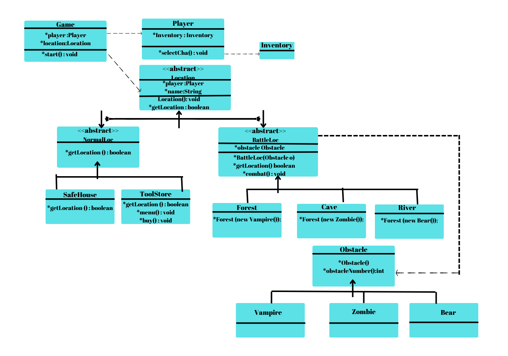

# JAVA-MONSTER-GAME-BACKEND

 
By choosing the place where they will fight, the players consume the features such as weapons, money, health and damage in the game. The game ends when the money features are reset.

JAVA,OOP technologies are used in the application.

# Software Versions:
- Java 8
- OOP

# Project Life Cycle

